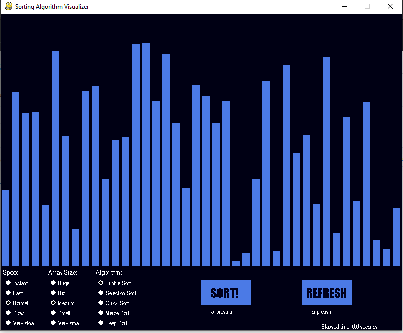
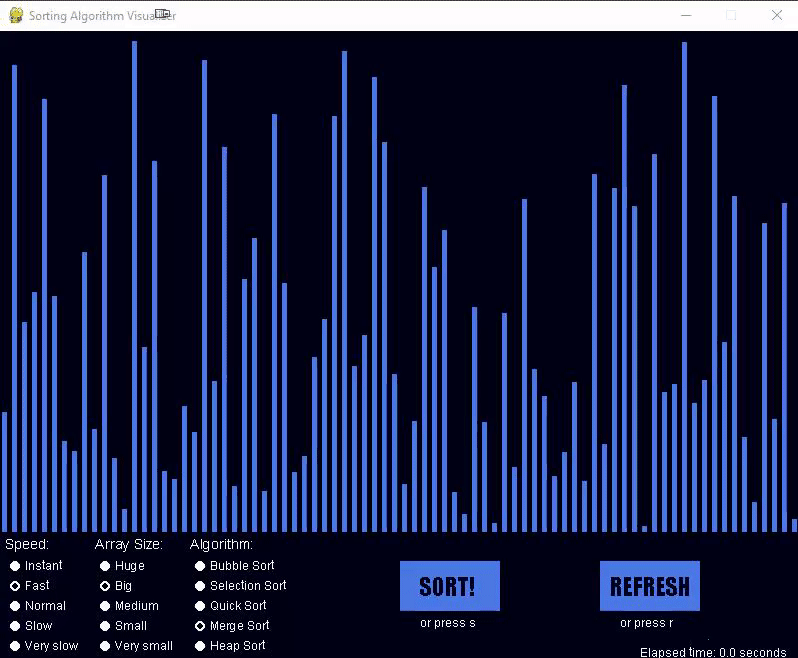

# SortVisualizationPython3

This is an app to visualize sorting algorithms in Python3 using Pygame.

### Requirements
You just need to install python3 and then instal pygame:

```
pip install pygame
```

### How to run?
To run just run code below in terminal:

```
python main.py
```

### How to use?

When you run the app the are buttons and radio checks to change dataset size, change visualization speed, and 
sleecting algorithm.



You can use start to start sorting and refresh to refresh datas.



*Made by Amirhossein Abaskohi*
